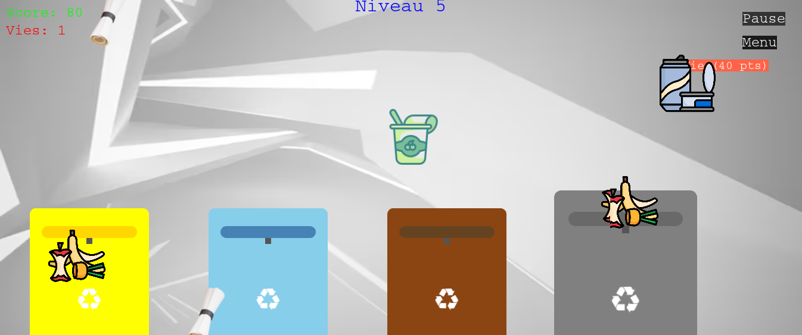

# RecycQuest : Un jeu éducatif sur le tri des déchets

## Description

RecycQuest est un jeu éducatif destiné aux enfants et aux adultes, conçu pour sensibiliser ces derniers au tri des déchets dans le cadre du développement durable. Cela va renforcer les comportements des joueurs envers l'environnement.

## Fonctionnalités

- **Tri des déchets** : Le joueur doit trier différents déchets dans les bonnes poubelles (déposer chaque déchet dans la poubelle correspondante).
- **Système de vies** : Le joueur commence avec 2 vies. En cas d'erreur de tri, il perd une vie. Si le joueur n'a plus de vies, la partie se termine (Game Over).
- **Système de points** : À chaque fois que le joueur effectue un tri correct, il gagne 20 points.
- **Chronomètre** : Le temps est limité par niveau. Si le temps s'écoule, le jeu se termine.
- **Progression des niveaux** : À chaque montée de niveau, la difficulté augmente (il y aura plus de déchets à trier).

## Comment jouer à RecycQuest

1. Triez chaque déchet dans sa poubelle correspondante (définie dans `tableau.js`).
2. Vous commencez avec 2 vies. Si vous commettez une erreur dans votre tri, vous perdez une vie.
3. Chaque niveau doit être terminé dans un temps limité. Si le temps s'écoule sans que vous ayez terminé de trier, vous perdrez une vie.
4. Les joueurs gagnent des points pour chaque déchet trié correctement.
5. Les niveaux deviennent progressivement plus difficiles, avec plus de déchets à trier et moins de temps.

## Technologies utilisées

- **JavaScript** : pour la logique du jeu (fonctions, actions, règles...)
- **Phaser** : framework pour créer des jeux 2D
- **Tableau** : pour stocker les informations sur les poubelles et les déchets
- **Git** : pour la gestion du projet et le travail en équipe

## Installation

git clone https://github.com/pthiam1/recycquest.git
cd recycquest

## Contribution

Les contributions sont les bienvenues. Veuillez suivre ces étapes pour contribuer :

1. Pour se positionner sur sa branche (git checkout ).
2. Committez vos changements (git commit -m 'message pour expliquer ce que tu veux commit').
3. Poussez vers la branche (git push origin <nom de la branche >).
4. Pour recuperer un fichier sur git (git pull).

## Auteur 
**THIAM PAPA**

